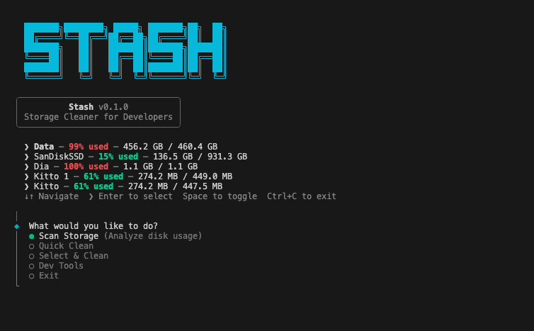

<div align="center">

<picture>
  <source media="(prefers-color-scheme: dark)" srcset="docs/logo-dark.svg">
  <source media="(prefers-color-scheme: light)" srcset="docs/logo-light.svg">
  
</picture>

<br>

**Your disk is full of junk. Let's fix that.**

[](https://www.npmjs.com/package/stashit)
[](https://nodejs.org)
[](https://www.typescriptlang.org)
[](LICENSE)

[Quick Start](#quick-start) · [What It Nukes](#what-it-nukes) · [How It Works](#how-it-works) · [Contributing](#contributing)

<br>



<br>

</div>

---

## TL;DR

```bash
npx stashit
```

That's it. One command. Watch the gigabytes come back.

## Why?

You've got **gigs of crap** sitting on your machine right now:

- `node_modules` caches from 47 abandoned side projects
- Xcode Derived Data from that one time you tried SwiftUI
- iOS Simulators for iOS versions that don't exist anymore
- Docker images you pulled once and forgot about
- Gradle, Maven, CocoaPods, pip — all hoarding downloads

You could hunt them down manually. Or you could just **stash it**.

## Quick Start

```bash
# Just run it. No install needed.
npx stashit

# Or install globally if you're a frequent cleaner
npm i -g stashit
stashit
```

> Requires **Node.js 22+**

## What It Nukes

### 🟢 Safe — just send it

These are caches. They re-download automatically. Zero risk.

| Target | What's hiding there |
|--------|-------------------|
| **npm / pnpm / Yarn** | Package manager download caches |
| **Homebrew** | Old bottles and logs |
| **pip** | Python package cache |
| **Xcode Derived Data** | Build artifacts that rebuild on open |
| **TypeScript / Playwright / Electron** | Compiler and browser caches |
| **CocoaPods / Gradle / Maven** | Dependency caches |
| **Docker** | Dangling images, stopped containers, build cache |
| **Chrome** | Browser cache |

### 🟡 Selective — you pick what goes

These need your attention. Stash shows you what's there, you choose what to axe.

| Target | What you're choosing |
|--------|---------------------|
| **iOS Simulators** | Which simulator devices to delete |
| **Android SDK** | Which platform versions to remove |
| **Android Emulators** | Which AVDs to trash |

### ⚪ Display Only — just so you know

Not touching these. Just showing you the damage.

| Target | Why it's here |
|--------|--------------|
| **Downloads** | You know what's in there. We both know. |
| **Screen Recordings** | That 4GB screen recording from last Tuesday. |

## Features

- **One command** — `npx stashit` and you're scanning
- **Smart detection** — only shows tools you actually have installed
- **APFS-aware** — accurate disk numbers on macOS, not the lies `df` tells
- **Safe by default** — won't delete anything risky without asking
- **Interactive** — pick exactly what to clean with multi-select
- **Quick Clean** — one-click nuke for all safe caches
- **Dev Tools Manager** — manage iOS Simulators, Android SDK & Emulators

## How It Works

```
stashit
├── packages/
│   ├── core/               Types & utilities
│   ├── engine/             Platform detection
│   ├── platform-mac/       macOS (23 categories)
│   ├── platform-windows/   Windows (coming soon)
│   └── platform-linux/     Linux (coming soon)
├── apps/
│   ├── cli/                The interactive CLI
│   └── mcp/                AI assistant integration (coming soon)
└── docs/
```

Every OS implements one interface. The engine picks the right one. The CLI (or MCP server, or future VSCode extension) just talks to the engine. Clean separation, works everywhere.

## Contributing

```bash
# Clone it
git clone https://github.com/iamB0ody/stashit.git
cd stash

# Install
pnpm install

# Run in dev mode
pnpm dev

# Other commands
pnpm build            # Build everything
pnpm typecheck        # Type-check
pnpm test             # Run tests
pnpm lint             # Lint
pnpm format           # Prettier
pnpm graph            # Nx dependency graph
```

### Project Map

| Package | What it does |
|---------|-------------|
| `@stash/core` | Types, interfaces, shared utils |
| `@stash/engine` | Detects your OS, returns the right platform |
| `@stash/platform-mac` | macOS support — 23 scan categories + dev tools |
| `@stash/platform-windows` | Windows support (placeholder) |
| `@stash/platform-linux` | Linux support (placeholder) |
| `@stash/cli` | The interactive CLI you see above |
| `@stash/mcp` | MCP server for AI coding assistants (placeholder) |

## Roadmap

- [x] macOS support (14 safe + 3 selective + 2 display categories)
- [x] Interactive CLI with Quick Clean & Select Clean
- [x] Dev Tools manager (iOS Sims, Android SDK, AVDs)
- [ ] `npx stashit` — publish to npm
- [ ] Windows support
- [ ] Linux support
- [ ] MCP server (Claude Code, Cline, Continue, Codex)
- [ ] CI/CD pipeline
- [ ] VSCode extension

## License

MIT — do whatever you want with it.

---

<div align="center">

**Your disk called. It said stash it.**

</div>
