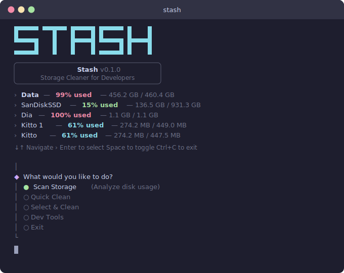

<div align="center">

<picture>
  <source media="(prefers-color-scheme: dark)" srcset="docs/logo-dark.svg">
  <source media="(prefers-color-scheme: light)" srcset="docs/logo-light.svg">
  
</picture>

**Multi-platform storage cleaner for developers**

[](https://nodejs.org)
[](https://www.typescriptlang.org)
[](https://pnpm.io)
[](LICENSE)

[Getting Started](#getting-started) · [Features](#features) · [Architecture](#architecture) · [Development](#development)

<br>



<br>

</div>

---

## What is Stash?

Stash finds and cleans developer caches, build artifacts, and unused tooling that silently eat your disk space. One scan, one click, gigabytes back.

- **Package manager caches** — npm, pnpm, Yarn, Homebrew, pip, CocoaPods, Gradle, Maven
- **Build artifacts** — Xcode Derived Data, TypeScript, Electron, Playwright
- **Dev tools** — iOS Simulators, Android SDK platforms, Android Emulators
- **Container cleanup** — Docker dangling images and build cache
- **Browser caches** — Chrome cache

## Getting Started

### Prerequisites

- **Node.js** ≥ 22.0.0
- **pnpm** ≥ 10.x

### Install & Run

```bash
# Clone the repository
git clone https://github.com/your-username/stash.git
cd stash

# Install dependencies
pnpm install

# Run the CLI
pnpm dev
```

## Features

### Three Risk Levels

| Level | Color | Behavior |
|-------|-------|----------|
| **Safe** | 🟢 Green | Auto-cleanup — caches that re-download on demand |
| **Selective** | 🟡 Yellow | You pick — choose which simulators, SDK versions, or emulators to remove |
| **Display Only** | ⚪ Gray | Awareness — shows size of Downloads, Screen Recordings, etc. |

### CLI Workflows

| Command | Description |
|---------|-------------|
| **Scan Storage** | Full disk analysis with per-category breakdown |
| **Quick Clean** | One-click cleanup of all safe caches |
| **Select & Clean** | Multi-select interface to pick what to clean |
| **Dev Tools** | Manage iOS Simulators, Android SDK, Android Emulators |

### Accurate Disk Reporting

On macOS, Stash parses APFS container data directly from `diskutil` for accurate capacity numbers — not the per-volume estimates that `df` reports.

## Architecture

```
@stash/monorepo
├── packages/
│   ├── core/               Shared types, interfaces, utilities
│   ├── engine/             Platform detection & factory
│   ├── platform-mac/       macOS implementation (23 categories)
│   ├── platform-windows/   Windows (coming soon)
│   └── platform-linux/     Linux (coming soon)
├── apps/
│   ├── cli/                Interactive terminal UI
│   └── mcp/                MCP server for AI assistants (coming soon)
└── docs/
```

### Design Principles

- **Platform abstraction** — each OS implements a single `Platform` interface
- **Factory pattern** — the engine detects the OS and returns the right implementation
- **Channel-agnostic** — core logic is decoupled from the UI layer (CLI, MCP, future extensions)
- **Monorepo** — Nx workspace with pnpm for fast, incremental builds

### Platform Interface

Every platform implements this contract:

```typescript
interface Platform {
  readonly name: string;
  readonly id: 'mac' | 'windows' | 'linux';

  getStorageOverview(): Promise<StorageOverview>;
  getCategories(): Category[];
  scanCategory(category: Category): Promise<ScanResult>;
  scanAll(onProgress?: (name: string) => void): Promise<ScanResult[]>;
  cleanItem(id: string): Promise<CleanResult>;
  cleanAllSafe(): Promise<CleanResult[]>;
  listSelectiveItems(id: string): Promise<DevToolItem[]>;
  deleteSelectiveItems(categoryId: string, itemIds: string[]): Promise<CleanResult[]>;
}
```

## macOS Categories

<details>
<summary><strong>Safe (auto-cleanup)</strong></summary>

| Category | Clean Command |
|----------|--------------|
| Yarn Cache | `yarn cache clean` |
| pnpm Store | `pnpm store prune` |
| npm Cache | `npm cache clean --force` |
| Homebrew Cache | `brew cleanup --prune=all` |
| pip Cache | `pip cache purge` |
| Xcode Derived Data | `rm -rf ~/Library/Developer/Xcode/DerivedData/*` |
| TypeScript Cache | `rm -rf ~/Library/Caches/typescript/*` |
| Playwright Cache | `rm -rf ~/Library/Caches/ms-playwright/*` |
| Electron Cache | `rm -rf ~/Library/Caches/electron/*` |
| CocoaPods Cache | `pod cache clean --all` |
| Gradle Cache | `rm -rf ~/.gradle/caches/*` |
| Maven Local Repository | `rm -rf ~/.m2/repository/*` |
| Docker (dangling) | `docker system prune -f` |
| Google Chrome Cache | `rm -rf ~/Library/Caches/Google/Chrome/*` |

</details>

<details>
<summary><strong>Selective (user picks)</strong></summary>

| Category | What you choose |
|----------|----------------|
| iOS Simulators | Individual simulator devices by runtime |
| Android SDK | Platform versions to remove |
| Android Emulators | AVDs to delete |

</details>

<details>
<summary><strong>Display only (awareness)</strong></summary>

| Category | Path |
|----------|------|
| Screen Recordings | `~/Desktop`, `~/Movies` |
| Downloads | `~/Downloads` |

</details>

## Development

### Scripts

```bash
pnpm dev              # Run the CLI in dev mode
pnpm build            # Build all packages
pnpm typecheck        # Type-check all packages
pnpm test             # Run all tests
pnpm lint             # Lint all packages
pnpm format           # Format with Prettier
pnpm graph            # Visualize dependency graph
```

### Project Structure

| Package | Description |
|---------|-------------|
| `@stash/core` | Shared types (`Category`, `ScanResult`, `CleanResult`, `Platform`) and utilities (`formatBytes`, `getDirectorySize`, `runCommand`) |
| `@stash/engine` | Detects the current OS and returns the right `Platform` implementation |
| `@stash/platform-mac` | Full macOS support — scanner, cleaner, dev tools (23 categories) |
| `@stash/platform-windows` | Windows support (placeholder) |
| `@stash/platform-linux` | Linux support (placeholder) |
| `@stash/cli` | Interactive CLI built with `@clack/prompts`, `chalk`, `ora`, `boxen` |
| `@stash/mcp` | MCP server for AI coding assistants (placeholder) |

### Tech Stack

- **Monorepo** — Nx 20 + pnpm workspaces
- **Language** — TypeScript 5.8 (ESM)
- **CLI UI** — @clack/prompts, chalk, ora, boxen, cli-table3, figures
- **Formatting** — Prettier

## Roadmap

- [ ] Windows platform support
- [ ] Linux platform support
- [ ] MCP server for AI assistants (Claude Code, Cline, Continue)
- [ ] Test suite
- [ ] CI/CD pipeline
- [ ] npm publishing (`npx stash`)
- [ ] VSCode extension

## License

MIT
